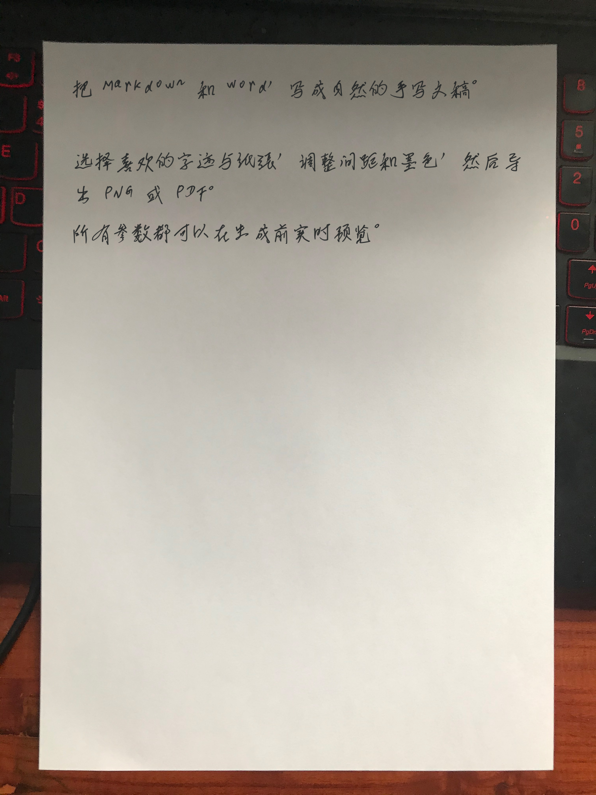

<div align="center">

# HandDraft

**把 Markdown 和 Word，排成自然、可调、可导出的中文手写文稿。**

本地优先 · 真实手写字体 · 自定义实拍纸张 · PNG / PDF / ZIP

[在线体验](https://handdraft-demo-nbbc.onrender.com) · [一分钟启动](#一分钟启动) · [功能说明](#主要功能) · [English](README_EN.md)

[](https://github.com/N-BBC/HandDraft/stargazers)
[](LICENSE)
[](https://www.python.org/)
[](https://fastapi.tiangolo.com/)

</div>


> [!TIP]
> 在线演示最多生成 6 页，文件会在 60 分钟后自动清理。敏感文档建议使用本地模式。

## 主要功能

- 读取 `.md`、`.markdown`、`.txt` 和 `.docx`，也可以直接输入文字
- 六款授权参考项目手写字体，以及 Xiaolai、LXGW WenKai 等 OFL 字体
- 上传一张包含纸张与周边环境的照片，直接在真实纸面区域排字
- 独立调整字号、行距、字距、段距、左右边距、墨色和自然起伏
- 实时预览，生成多页 PNG、PDF 和 ZIP
- 本地模式不上传文档，API Key 不写盘、不进入浏览器存储
- 公网演示提供限流、页数限制、上传限制和过期文件清理

<div align="center">
  
</div>

## 一分钟启动

### Windows

```powershell
git clone https://github.com/N-BBC/HandDraft.git
cd HandDraft
python -m venv .venv
.\.venv\Scripts\python -m pip install -r requirements.txt
.\run.ps1
```

打开 `http://127.0.0.1:8017`。如果 PowerShell 禁止执行脚本：

```powershell
powershell.exe -NoProfile -ExecutionPolicy Bypass -File .\run.ps1
```

### Docker

```bash
git clone https://github.com/N-BBC/HandDraft.git
cd HandDraft
docker build -t handdraft .
docker run --rm -p 8017:8017 handdraft
```

## 在线部署

仓库包含 `Dockerfile` 和 `render.yaml`，可直接部署到 Render：

[](https://render.com/deploy?repo=https://github.com/N-BBC/HandDraft)

公网演示建议启用：

```env
HANDDRAFT_DEMO_MODE=1
HANDDRAFT_JOB_TTL_SECONDS=3600
HANDDRAFT_RATE_LIMIT=6
HANDDRAFT_RATE_WINDOW_SECONDS=60
HANDDRAFT_MAX_PAGES=6
```

演示模式会隐藏 AI Key 入口、禁止下载新字体，并对生成接口实施每 IP 限流。
它适合公开试用，但不能替代正式产品所需的账号、持久化存储和完整风控。

## 字体与模板来源

HandDraft 从 [`huadeng863/handwriting-font-conversion`](https://gitee.com/huadeng863/handwriting-font-conversion)
接入李国夫、青叶、国祥、戴锦好、义启和立夏六款字体，以及原项目实拍纸张模板。
相关来源与许可记录见：

- 字体记录：[`data/fonts/REFERENCE-FONTS-SOURCE.md`](data/fonts/REFERENCE-FONTS-SOURCE.md)
- 模板记录：[`static/assets/papers/SOURCE.md`](static/assets/papers/SOURCE.md)
- 第三方说明：[`THIRD_PARTY_NOTICES.md`](THIRD_PARTY_NOTICES.md)

OFL 字体保持各自的 SIL Open Font License。HandDraft 源代码采用 MIT License，
但 MIT License 不会重新授权第三方字体和照片。

## API Key 安全

- Key 不写进前端源代码
- Key 不保存到 `localStorage` 或 `sessionStorage`
- 后端不写盘、不回显完整 Key，日志会对疑似密钥打码
- 在线演示完全禁用 API Key 入口
- AI 字迹库当前仍是预留接口，尚未调用外部模型

## 测试

```powershell
.\.venv\Scripts\python.exe -m unittest discover -s tests -v
.\.venv\Scripts\python.exe scripts\smoke_test.py
.\.venv\Scripts\python.exe scripts\acceptance_test.py
```

验收范围包括所有内置纸张模板、Markdown、Word、单图自定义实拍模板、
PNG/PDF/ZIP、默认字体、演示限流、过期清理和 API Key 打码。

## 参与项目

欢迎提交 Issue、纸张模板适配、部署方案和界面改进。准备贡献代码前请先说明
资源来源与许可证。觉得项目有用，可以点一个 Star，让更多需要中文手写排版的人看到它。

请将 HandDraft 用于排版、设计与个人文稿，不要用于伪造签名、身份材料或规避真实性要求。
