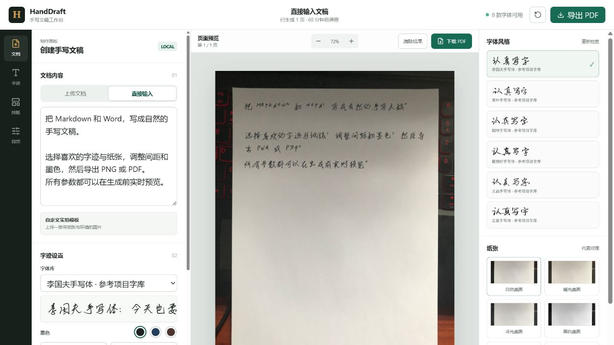

<div align="center">

# HandDraft

**Turn Markdown and Word documents into natural, adjustable handwriting.**

Local-first · Chinese handwriting fonts · Photo paper templates · PNG / PDF / ZIP

[Live Demo](https://handdraft-demo-nbbc.onrender.com) · [Quick Start](#quick-start) · [中文](README.md)

</div>



> [!TIP]
> The public demo renders up to 6 pages and removes files after 60 minutes.
> Run HandDraft locally for sensitive documents.

## Highlights

- Import Markdown, plain text, and DOCX, or type directly in the editor
- Use bundled handwriting fonts or upload a TTF, OTF, or TTC font
- Write directly onto a single photo containing both paper and its surroundings
- Adjust font size, line spacing, character spacing, margins, ink, and subtle variation
- Preview live and export multi-page PNG, PDF, and ZIP files
- Keep documents local when self-hosting
- Protect public demos with rate limits, upload limits, page caps, and job expiry

## Quick Start

```bash
git clone https://github.com/N-BBC/HandDraft.git
cd HandDraft
python -m venv .venv
python -m pip install -r requirements.txt
python -m uvicorn handdraft.main:app --host 127.0.0.1 --port 8017
```

Open `http://127.0.0.1:8017`.

### Docker

```bash
docker build -t handdraft .
docker run --rm -p 8017:8017 handdraft
```

## Public Demo Mode

Set `HANDDRAFT_DEMO_MODE=1` to enable per-IP render limits, a six-page cap,
smaller upload limits, automatic job cleanup, and removal of the API-key UI.
See [`render.yaml`](render.yaml) for a complete deployment configuration.

## Fonts, Templates, and Licensing

HandDraft includes fonts and paper templates sourced from
[`huadeng863/handwriting-font-conversion`](https://gitee.com/huadeng863/handwriting-font-conversion).
See [`THIRD_PARTY_NOTICES.md`](THIRD_PARTY_NOTICES.md) for attribution and
license boundaries. HandDraft source code is MIT licensed; bundled fonts and
photographs retain their respective licenses or permissions.

Use HandDraft for layout, design, and personal documents. Do not use it to
forge signatures or identity documents, or to evade authenticity requirements.
